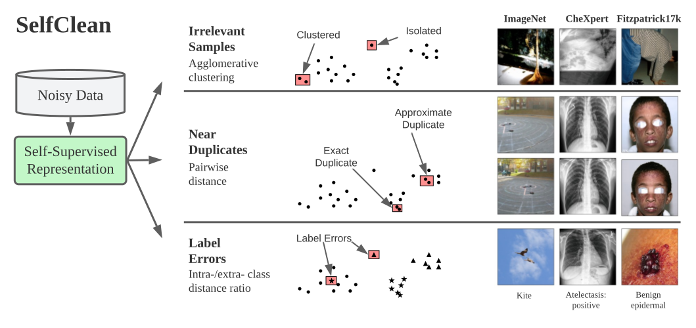

# SelfClean
A holistic self-supervised data cleaning strategy to detect irrelevant samples, near duplicates and label errors.

<p align="center">
  
</p>

[**SelfClean Paper**](https://arxiv.org/abs/2305.17048)

Run `make` for a list of possible targets.

## Installation
Run this command for installation
```bash
make init
make update_data_ref
make install
```

## Code and test conventions
- `black` for code style
- `isort` for import sorting
- `pytest` for running tests
- docstring style: `sphinx`

### Development installation and configurations
To set up your dev environment run:
```bash
pip install -r requirements.txt
pre-commit install
```
To run all the linters on all files:
```bash
pre-commit run --all-files
```
